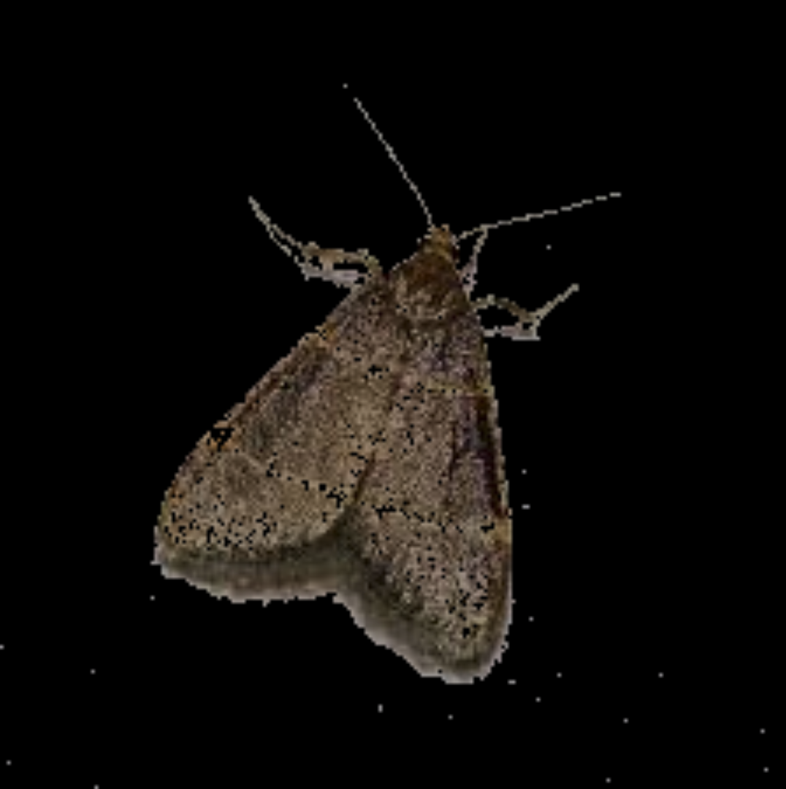

# MothCam: Automated Photography of Nocturnal Lepidoptera for Urban Citizen Science

*Moth being automatically isolated with Python script.*

## Project

I aim to develop a low-cost, deployable automatic moth camera that uses computer vision and deep learning to monitor moth populations. This device will improve data collection on moth behavior, population trends, and seasonal changes, supporting more effective conservation efforts.

## Rationale

Moths are vital nocturnal pollinators and a key food source for many bird species, yet their populations are declining due to habitat loss, pesticides, light pollution, and climate change. Traditional monitoring methods are labor-intensive and limited, highlighting the need for automated solutions.

Qouting my paper:

> Moths, a part of the Lepidoptera genus, are among the most important but underappreciated pollinators, and are often overlooked (Walton et al., 2020). Unlike bees, which are active during the day, moths primarily operate at night, contributing to the pollination of plants that bloom outside of daylight hours. Recent studies show that moths, such as the large yellow underwing, are significant pollinators of key agricultural crops like red clover, with researchers finding that up to 34% of pollination in red clover was performed by moths (Kuta, 2022). Moths are thought to be responsible for pollinating hundreds of other less-studied species, particularly nocturnal blooms, and likely play a much larger role in global ecosystems than previously recognized (Why Moths Matter, n.d.).
>
> In addition to their critical pollination services, moths are also a fundamental part of the food chain. Their larvae (caterpillars) are vital for the survival of many bird species. For example, blue tit chicks, a common species in Europe, rely on moth caterpillars for nutrition, with an estimated 35 billion caterpillars needed annually to sustain these birds (Why Moths Matter, n.d.) In fact, 60% of bird species could face catastrophic population declines if moth populations were to plummet​ (Why Moths Matter, n.d.)
>
> The decline of moth populations globally has been linked to habitat loss, pesticides, light pollution, and climate change. These factors pose serious risks not only to moths but to the broader ecosystems they support​ (Why Moths Matter, n.d.) Protecting and preserving moth populations is therefore crucial, and one of the first steps toward this goal is accurate data collection.
>
> Data collection provides insights into population sizes, behavioral patterns, and environmental interactions. For moths, traditional data collection involves manually photographing them after they are attracted to floodlights and white sheets. However, this method is labor-intensive, prone to human error, and excludes many moth species not drawn to such lighting. This process is begging for automation to reduce labor, improve the breadth of species captured, and minimize human error. Automation will allow researchers to gather more comprehensive data on moth activity, such as population sizes, nocturnal behavior patterns, and seasonal changes, enabling more informed conservation efforts to protect these essential creatures.
>
> New technologies, like computer vision-based light traps and deep learning algorithms, have already shown promise for an automatic moth trap. These systems can automatically attract, track, and classify moth species based on captured images. For example, a recent study demonstrated that a deep learning model successfully classified over 2,000 labeled moth images with high accuracy, capturing data over long periods without requiring constant human supervision (Bjerge et al., 2021). This approach not only reduces labor but also eliminates errors that arise from manual counting and species identification.
>
> However, a low-cost and rapidly deployable automatic moth camera is still lacking. A device with those features would allow for a whole network of moth monitors, mounted in rural, suburban, and urban areas by homeowners. This will open up more possibilities in the moth monitoring world. 

> 1. Kuta, S. (2022, July 28). Moths are the unsung heroes of pollination. Smithsonian Magazine. https://www.smithsonianmag.com/smart-news/moths-are-the-unsung-heroes-of-pollination-180980491/
> 2. Why moths matter. (n.d.). Butterfly Conservation. https://butterfly-conservation.org/moths/why-moths-matter 
> 3. Bjerge, K., Nielsen, J. B., Sepstrup, M. V., Helsing-Nielsen, F., & Høye, T. T. (2021). An automated light trap to monitor moths (Lepidoptera) using computer Vision-Based tracking and deep learning. Sensors, 21(2), 343. https://doi.org/10.3390/s21020343
> 4. Brehm, G. (2017). A new LED lamp for the collection of nocturnal Lepidoptera and a spectral comparison of light-trapping lamps. Nota Lepidopterologica, 40(1), 87–108. https://doi.org/10.3897/nl.40.11887 
> 5. Walton, R. E., Sayer, C. D., Bennion, H., & Axmacher, J. C. (2020). Nocturnal pollinators strongly contribute to pollen transport of wild flowers in an agricultural landscape. Biology Letters, 16(5), 20190877. https://doi.org/10.1098/rsbl.2019.0877 

## More information

I plan to submit my project to my regional and then state science fair, MSEF. I made a project plan and proposal that goes into much deeper detail. You can read it [here](/Project%20plan.pdf). 

## License

Both the software and documentation are under the [GNU GPL v3 license](https://choosealicense.com/licenses/gpl-3.0/). The hardware and the 3D files are under the [CERN Open Hardware Licence Version 2 - Strongly Reciprocal](https://choosealicense.com/licenses/cern-ohl-s-2.0/). The media is under the [CC BY 4.0 DEED](https://creativecommons.org/licenses/by/4.0/).